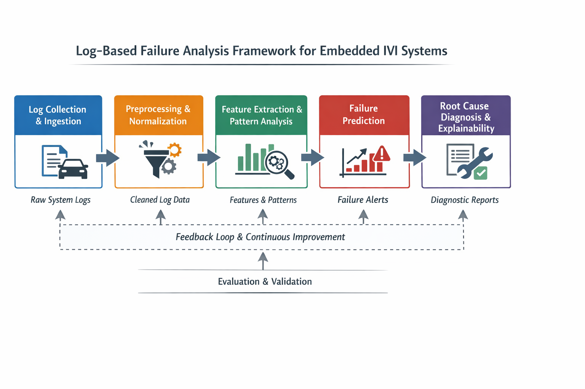

# Framework Design

## Framework Architecture Diagram

## Overview
This section presents the proposed software engineering framework for predicting
and diagnosing failures in embedded infotainment (IVI) systems using log-based
analysis. The framework is designed to support industrial constraints such as
limited resources, heterogeneous log formats, and the need for explainable
diagnostic outputs.

The framework follows a modular and layered design, enabling systematic analysis
from raw log data to actionable diagnostic insights.

## Design Principles
The framework is guided by the following principles:
- **Modularity:** Each processing stage is independent and replaceable.
- **Scalability:** Able to handle large volumes of log data.
- **Explainability:** Diagnostic outputs must be interpretable by engineers.
- **Industrial Relevance:** Aligned with embedded software development workflows.
- **Traceability:** Clear mapping from logs to predictions and diagnoses.

## Framework Architecture
The proposed framework consists of five main components:

### 1. Log Collection & Ingestion
This component gathers logs generated from embedded IVI systems, including system,
application, and middleware logs. It ensures time synchronization, severity
normalization, and compatibility with heterogeneous log formats.

**Input:** Raw log files from IVI systems  
**Output:** Standardized log streams

---

### 2. Log Preprocessing & Normalization
Raw logs are filtered, cleaned, and structured to remove noise and irrelevant
entries. This step includes parsing unstructured logs, handling missing values,
and aligning logs based on timestamps and execution context.

**Input:** Standardized log streams  
**Output:** Structured and cleaned log data

---

### 3. Feature Extraction & Pattern Analysis
This component extracts meaningful features from logs, such as event frequency,
temporal sequences, and severity patterns. Pattern analysis techniques are applied
to identify abnormal behaviors and recurring failure signatures.

**Input:** Structured log data  
**Output:** Log features and detected patterns

---

### 4. Failure Prediction Module
Using extracted features and identified patterns, this module predicts potential
failure events before they occur. The prediction may be performed using rule-based,
statistical, or machine learning approaches, depending on system constraints.

**Input:** Log features and patterns  
**Output:** Failure predictions and risk indicators

---

### 5. Root Cause Diagnosis & Explainability
This component analyzes predicted or observed failures to identify likely root
causes. Diagnostic results are presented in an explainable manner, supporting
engineers in understanding the relationships between log events and system faults.

**Input:** Failure predictions and log patterns  
**Output:** Explainable diagnostic reports and root cause insights

## Framework Workflow
The framework operates in a sequential yet iterative workflow, where diagnostic
results can be fed back to improve feature extraction and prediction accuracy.

## Alignment with Research Questions
- RQ1: Addressed by log collection and taxonomy definition.
- RQ2: Addressed by preprocessing and feature extraction components.
- RQ3: Addressed by the failure prediction module.
- RQ4: Addressed by the root cause diagnosis and explainability component.
- RQ5: Addressed through framework evaluation and validation.

## Extensibility
The framework is designed to allow future integration of additional analysis
techniques, new log sources, and domain-specific diagnostic rules without
restructuring the entire system.
