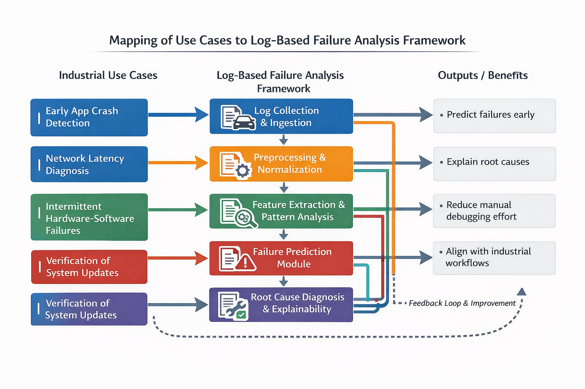

# Use Cases for Log-Based Failure Analysis Framework

## Use Case Mapping Diagram

*Figure 1: Mapping of industrial use cases to framework components and resulting benefits.*

## Purpose
The use cases demonstrate how the proposed framework can be applied in
embedded infotainment (IVI) systems under industrial scenarios. They illustrate
typical situations where log-based analysis improves failure prediction,
diagnosis, and overall system reliability.

---

## Use Case 1: Early Detection of Application Crashes

**Actor:** Software Engineer / QA Team  
**Scenario:** An IVI media application occasionally crashes during startup.  
**Framework Role:**  
1. Logs from the application and middleware layers are collected.  
2. Preprocessing normalizes logs and filters out irrelevant entries.  
3. Feature extraction identifies patterns preceding the crash.  
4. Failure prediction module detects early indicators of the crash.  
5. Root cause diagnosis links the failure to a memory leak in the application.  
**Outcome:** Engineer receives actionable diagnostic output, reducing manual debugging time.

---

## Use Case 2: Network Latency Diagnosis in Connected IVI Systems

**Actor:** System Engineer / Network Specialist  
**Scenario:** Navigation and connectivity services experience intermittent delays.  
**Framework Role:**  
1. System-level and middleware logs are collected (e.g., IPC, network events).  
2. Preprocessing aligns timestamps and filters noise.  
3. Pattern analysis identifies recurring delays correlated with message queue overflows.  
4. Failure prediction module alerts engineers before critical failures occur.  
5. Diagnosis module pinpoints the source of latency within the communication bus.  
**Outcome:** Engineers can proactively optimize network handling and prevent system degradation.

---

## Use Case 3: Detecting Intermittent Hardware-Software Interaction Failures

**Actor:** Embedded Software Engineer / QA  
**Scenario:** IVI system occasionally freezes when multiple applications run simultaneously.  
**Framework Role:**  
1. Logs from system, middleware, and applications are collected and synchronized.  
2. Feature extraction identifies temporal sequences and resource contention patterns.  
3. Prediction module identifies high-risk periods for potential freezing.  
4. Diagnosis module maps these events to CPU/memory resource exhaustion.  
**Outcome:** Engineers can implement corrective measures, preventing in-field failures.

---

## Use Case 4: Verification of System Updates

**Actor:** Release Engineer / QA Team  
**Scenario:** New software update may introduce unforeseen faults in IVI applications.  
**Framework Role:**  
1. Logs from post-update system execution are collected.  
2. Preprocessing ensures comparability with baseline logs.  
3. Pattern mining detects deviations from normal behavior.  
4. Prediction module identifies potential risks.  
5. Diagnosis module provides explainable insights for update validation.  
**Outcome:** Early detection of update-related issues ensures safe deployment.

---

## Summary
These use cases demonstrate that the proposed framework can:
- Predict failures before they occur  
- Diagnose root causes in an explainable manner  
- Reduce manual debugging effort  
- Align with industrial embedded software workflows  

The use cases serve as **guidance for evaluation** and future industrial validation.
